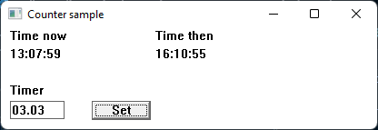

# C++ Counter project

### Note! This is merely a personal training project where C++ and win32 GUI plays main part.

The application will run on a window and show current time in `HH:mm:ss` format updating every second. Then there's a input box for additional timer adjust. Currently supporting only hours to be added. After pressing `Set` button, the application will update new time to window.

What to do:
- [x] GUI with components
- [x] Current time and timer
- [ ] Bugfix: Times are sometimes messing up
- [ ] Use minutes too for timer, format checking
- [ ] Alert when timer is completed